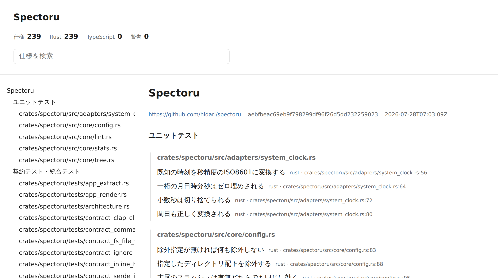

# Spectoru

Rust と TypeScript (Vitest) のテストソースをパースし、「仕様としてのテスト」を静的サイトとして可視化する CLI ツールです。



*（spectoru 自身のテストを spectoru で可視化したもの）*

## 解決したい課題

テストは仕様を表現する最も信頼できる情報源ですが、ソースコードを直接読まないと全体像が見えません。テスト名と階層構造を検索可能な静的サイトにすることで、「今このプロジェクトは何ができるのか」をテストの一覧から素早く把握できるようにします。

複数のリポジトリ（バックエンド、フロントエンド、監視システムなど）にまたがる仕様を一つのサイトに集約することもできます。

### 名前の由来

「spec（仕様）を取る」という日本語の掛詞であり、同時にフランス語で「スペクトラム」を意味する `spectre` の響きを持ちます。光のスペクトルがプリズムを通じて不可視の成分を可視化するように、Spectoru はソースコード中に埋もれたテスト仕様を抽出します。末尾の `ru` は Rust 実装であることを示します。

## インストール

```bash
cargo install --git https://github.com/hidari/spectoru
```

[Releases](https://github.com/hidari/spectoru/releases) にビルド済みバイナリ（Linux x86_64 / macOS arm64）も置いています。

## クイックスタート

リポジトリのルートに `spec-site.toml` を置きます。

```toml
[project]
name = "Astralys"

[[sources]]
name = "Backend"
kind = "rust"
paths = ["src/", "tests/"]
```

あとは実行するだけです。

```bash
spectoru build
```

`dist/index.html` が生成されます。ブラウザで開いてください。

## 仕様としてのテストの書き方

spectoru は **テスト名をそのまま仕様文として表示します**。snake_case をスペース区切りに開くような変換は一切行いません。したがって、テスト名自体が人間にとって読める仕様文であることが前提になります。

Rust の識別子は Unicode に対応しているため、日本語でテスト名を書けます。

### Rust

ファイルパスが自然な最上位のグルーピングになります。`mod` は必要に応じてサブグループとして使えますが、必須ではありません。

```rust
// tests/integration/artwork_creation.rs

mod 有効な画像がアップロードされたとき {
    #[tokio::test]
    async fn 作品が公開状態で作成される() { /* ... */ }

    #[tokio::test]
    async fn コラボレーターにクレジットが付与される() { /* ... */ }
}

mod タイトルが未入力のとき {
    #[test]
    fn バリデーションエラーが返される() { /* ... */ }
}
```

E2E テストのようにシンプルなユーザーストーリーなら、フラットに並べても構いません。

```rust
// tests/e2e/creator_registration.rs

#[tokio::test]
async fn 招待リンクからクリエイター登録が完了する() { /* ... */ }

#[test]
fn 無効な招待コードでは登録できない() { /* ... */ }
```

- テストの判定はアトリビュートのパスの**最終セグメントが `test` であること**で行います。`#[test]` `#[tokio::test]` `#[async_std::test]` `#[test_log::test]` などが同じ規則で拾えます
- `#[ignore]` が付いたテストは `skipped` として記録します。仕様としては存在しているので spec 数には数え、サイト上では区別して表示します
- **`mod tests` と `mod test` は階層から取り除き、中身を親に引き上げます。** ユニットテストを収めるための慣習的な容器であって、仕様文としての意味を持たないためです。意味のある名前を付けた `mod` はそのままグループになります
- テストを 1 つも含まないモジュールはグループにしません

### Vitest

`describe` によるネストは任意です。`it` と `test` は同等に扱います。

```typescript
// app/tests/artwork-creation.test.ts

describe("有効な画像がアップロードされたとき", () => {
  it("作品が公開状態で作成される", () => { /* ... */ });
  it("コラボレーターにクレジットが付与される", () => { /* ... */ });
});
```

| 記法 | 解釈 |
|---|---|
| `it.skip` / `it.todo` / `describe.skip` | `skipped`。`describe.skip` の中のテストも引き継ぎます |
| `it.only` | 通常の spec。実行の絞り込みであって、仕様が無効という意味ではありません |
| `it.each` / `it.for` | 対象外。名前が実行時にしか決まらないため警告として記録します |

テスト名は文字列リテラルか、補間を含まないテンプレートリテラルである必要があります。変数や補間つきテンプレートリテラル（`` it(`${条件}のとき`) ``）は静的に名前が決まらないため、サイトには含めず警告として記録します。

`.tsx` は TSX 文法でパースします。

## 設定ファイル

```toml
[project]
name = "Astralys"
repository = "https://github.com/HermitianHQ/astralys"  # 省略可

[[sources]]
name = "Backend"
kind = "rust"          # rust | vitest
paths = ["src/", "tests/"]

[[sources]]
name = "Frontend"
kind = "vitest"
paths = ["app/"]
exclude = ["app/tests/fixtures/"]  # 省略可

[lint]
max_depth = 4  # ネスト深さの上限（既定: 4）
```

`paths` と `exclude` は設定ファイルのあるディレクトリからの相対パスです。

### exclude

テストのフィクスチャや生成コードのように、ソースツリーには存在するが仕様ではないものを外します。glob ではなく**パスの前方一致**で判定し、比較はパスの構成要素単位で行います（`tests/fix` は `tests/fixtures/` に一致しません）。

`.gitignore` に載っているファイルと `target/` `node_modules/` は指定しなくても常に除外されます。

### 警告

書き方の自由度は尊重しつつ、仕様としての可読性が損なわれる場合に警告を出します。

- ネストの深さが上限を超えている場合。テストの条件分岐が深すぎるということは、テスト対象の実装自体が複雑すぎる可能性を示唆するシグナルでもあります
- テスト名が空文字の場合
- テスト名が静的に決まらない場合

## コマンド

```bash
# ソースをパースして静的サイトを生成（extract + render）
spectoru build --config spec-site.toml --out dist/

# JSON フラグメントだけを出力（複数リポジトリ集約用）
spectoru extract --config spec-site.toml --out spec-fragment.json

# 複数のフラグメントから 1 つのサイトを生成
spectoru render --fragments backend.json frontend.json --out dist/

# 規約チェックのみ（CI の品質ゲート向け）
spectoru lint --strict
```

引数を省略したときの既定値は `--config spec-site.toml`、`--out dist`（`extract` は `spec-fragment.json`）です。

`--revision` は git メタデータが手に入らない環境（shallow clone、コンテナ内ビルドなど）で revision を明示するためのものです。

### 終了コード

| 状況 | code |
|---|---|
| 正常終了 | 0 |
| 品質ゲートに掛かった | 1 |
| spectoru が動けなかった（設定が読めない、出力できない等） | 2 |

品質ゲートは **error があれば常に**、warning は `--strict` のときだけ落とします。error になるのはソースを解釈できず、その仕様がサイトから丸ごと欠落する場合（構文エラー、ファイルの読み込み失敗）です。ネストの深さやテスト名の書き方は warning にとどめ、ゲートにするかは `--strict` で選べます。

品質ゲートと実行エラーを別のコードにしているので、CI 側で「仕様の書き方の問題」と「ツールが動かなかった」を区別できます。

診断は `file:line: level[code]: message` の形式で stderr に出力します。エディタや CI のアノテーションがそのまま拾える形式です。

## 生成されるサイトについて

- **単一 HTML、外部依存ゼロ。** CDN を含め外部ホストへのリクエストを一切行いません
- テスト名は任意の文字列（`<script>` を含みうる）として扱い、必ずエスケープします
- JavaScript を無効にしても全仕様が読めます。検索はページ内の絞り込みとして動作します

## CI 統合

### 単一リポジトリ

```yaml
- name: Install spectoru
  run: cargo install --git https://github.com/hidari/spectoru
- name: Build spec site
  run: spectoru build --out dist/
```

`spectoru lint --strict` を別ステップにすれば、仕様の書き方そのものを品質ゲートにできます。

### 複数リポジトリ集約

各リポジトリの CI で `extract` を実行し、JSON フラグメントをストレージにアップロードします。

```yaml
- run: spectoru extract --out spec-fragment.json
- run: gsutil cp spec-fragment.json gs://spec-fragments/${{ github.repository }}/latest.json
```

集約用リポジトリの CI が全フラグメントを集めて `render` します。

```yaml
- run: gsutil -m cp "gs://spec-fragments/*/latest.json" fragments/
- run: spectoru render --fragments fragments/*.json --out dist/
```

## 開発

コマンドはすべて `cargo xtask` 経由で実行します。

```bash
cargo xtask fmt        # rustfmt
cargo xtask lint       # clippy（警告をエラーとして扱う）
cargo xtask test       # 全テスト
cargo xtask e2e        # 実バイナリに対する E2E のみ
cargo xtask ci         # fmt-check + lint + test
cargo xtask deny       # cargo-deny（advisories / licenses / bans / sources）
cargo xtask spec-site  # spectoru 自身の仕様サイトを生成
cargo xtask dist <target>  # 配布用アーカイブを作成
```

設計の背景は [`docs/planning/方向性.md`](docs/planning/方向性.md)、進行中の課題は [`docs/issues/`](docs/issues/) にあります。

### アーキテクチャ

ヘキサゴナルアーキテクチャと library-contract パターンを採用しています。

| 層 | 役割 | 外部 crate |
|---|---|---|
| `core/` | ドメイン値型と純関数 | 禁止 |
| `ports/` | 境界を定義する trait のみ | 禁止 |
| `app/` | ポートを合成するユースケース | 禁止（trait 経由） |
| `adapters/` | 外部 crate の具象実装 | ここだけ許可 |
| `cli.rs` | 合成ルート | — |

外部ライブラリをアダプター層に閉じ込めることで、バージョンアップ時の挙動確認を契約テストで行いやすくし、サプライチェーン攻撃の影響範囲をコアドメインから隔離しています。この境界は `tests/architecture.rs` がソースを走査して機械的に検証します。

## ライセンス

[MIT](LICENSE-MIT) または [Apache-2.0](LICENSE-APACHE) のデュアルライセンスです。お好きな方を選んでください。
